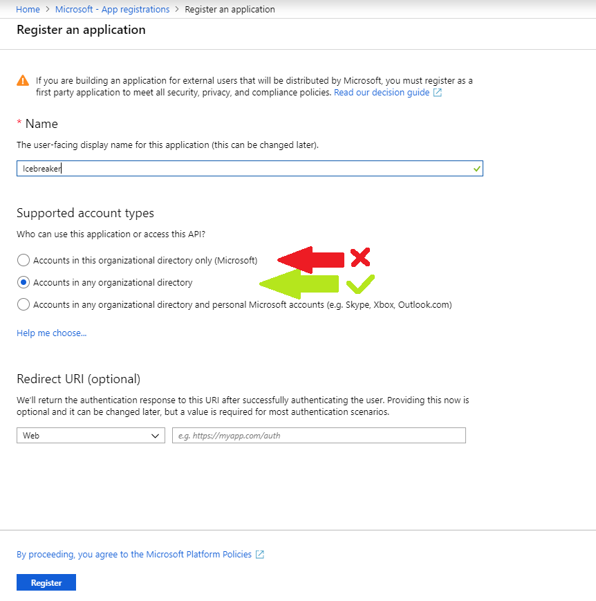
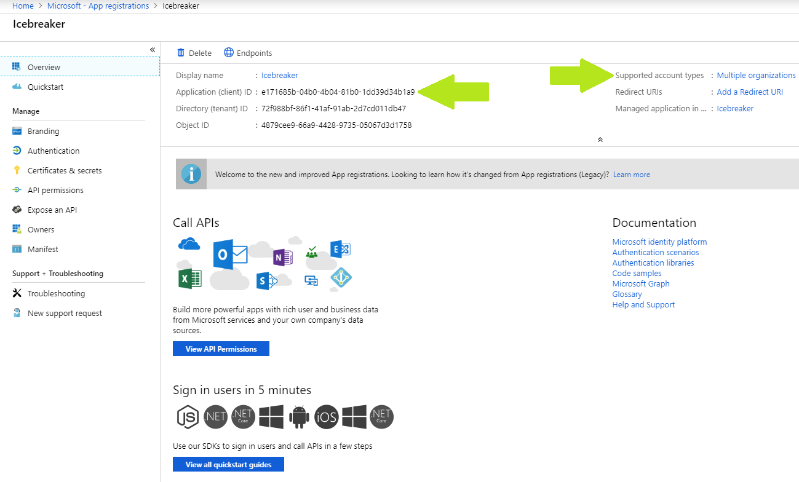
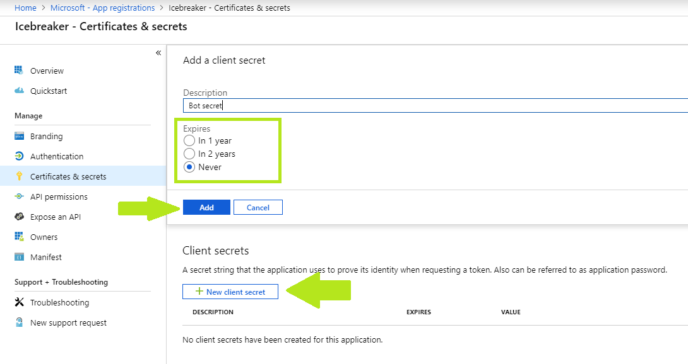
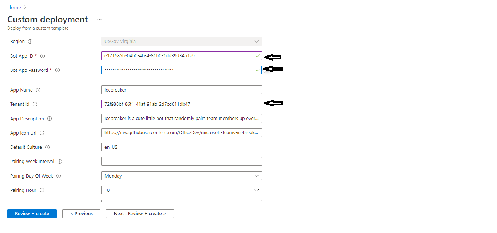
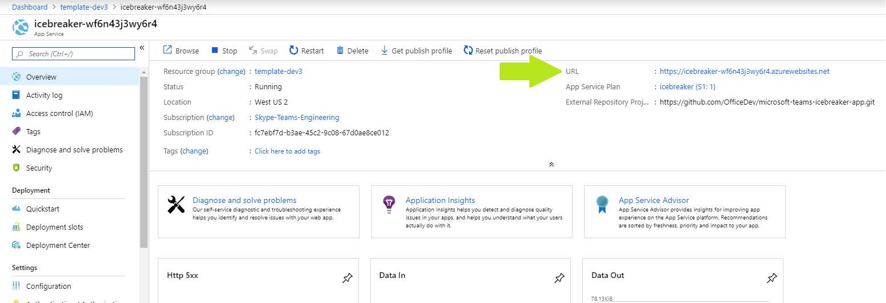
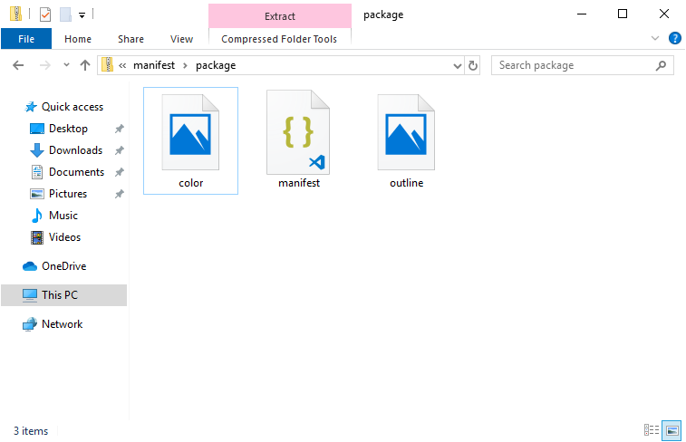

**Deployment in Azure Commercial + O365 GCC tenant**

For Azure Commercial + O365 GCC deployment, same [deployment guide](https://github.com/OfficeDev/microsoft-teams-apps-icebreaker/wiki/Deployment-guide) (available on Icebreaker GitHub repo) can be followed. Use O365 GCC tenant for App registration (Step 1 in deployment guide) and Azure commercial subscription for ARM deployment (Step 2 in deployment guide). Make sure tenant Id of O365 GCC tenant is added during ARM deployment.

**Deployment in O365 GCC and Azure Government tenant**

For Hybrid deployment, follow these deployment guide steps( <<TODO: Add link to deployment guide>> . _Deployment guide is added at the end of this document_)

- [Deployment Guide](#)

- [Prerequisites](#prerequisites)

- [Steps](#Deployment-Steps)

    - [Register Microsoft Azure AD application](#1-register-microsoft-azure-ad-application)

    - [Deploy bot service in Gcc Commercial](#2-deploy-to-your-azure-subscription)

    - [Deploy resources in GCC High](#3-deploy-to-your-azure-subscription)

    - [Create the Teams app packages](#4-create-the-teams-app-package)

    - [Run the app in Microsoft Teams](#5-run-the-app-in-microsoft-teams)

- [Troubleshooting](#troubleshooting)

***

## Prerequisites

To begin, you will need:

* An Azure subscription where you can create the following kinds of resources:

* Azure Logic App

* App Service

* App Service plan

* Bot Channels Registration

* Azure Cosmos DB account

* Application Insights

* A copy of the Icebreaker app GitHub repo (https://github.com/officedev/microsoft-teams-icebreaker-app)

# Deployment Steps

## 1. Register Microsoft Azure AD application

Register one Azure AD application in your commercial Azure subscription: for the bot and tab app authentication.

1. Log in to the Azure Portal for your subscription, and go to the “App registrations” blade at https://portal.azure.com/#blade/Microsoft_AAD_IAM/ActiveDirectoryMenuBlade/RegisteredAppsPreview.

2. Click on "New registration", and create an Azure AD application.

3. **Name**: The name of your Teams app - if you are following the template for a default deployment, we recommend "Icebreaker".

4. **Supported account types**: Select "Accounts in any organizational directory"

5. Leave the "Redirect URI" field blank.

6. Click on the "Register" button.

7. When the app is registered, you'll be taken to the app's "Overview" page. Copy the **Application (client) ID**; we will need it later. Also Copy the **Directory(tenant) ID** below **Application (client) ID**.
 Verify that the "Supported account types" is set to **Multiple organizations**.

8. On the side rail in the Manage section, navigate to the "Certificates & secrets" section. In the Client secrets section, click on "+ New client secret". Add a description for the secret and select an expiry time. Click "Add".

9. Once the client secret is created, copy its **Value**; we will need it later.

At this point you have 2 unique values:

* One application (client) ID

* One client secret

* One tenant ID

## 2. Deploy bot service in Gcc Commercial
  
1. Click on the "Deploy to Azure" button below.

2. When prompted, log in to your Commercial Azure subscription.

3. Azure will create a "Custom deployment" based on the ARM template and ask you to fill in the template parameters.

[[/Images/CustomDeployment.PNG|Custom deployment page]]

4. Select a subscription and resource group.

5. Enter a "Base Resource Name", which the template uses to generate names for the other resources.

  
  * The app service names `[Base Resource Name]`, must be available. For example, if you select contosoicebreaker as the base name, the names contosoicebreaker must be available (not taken); otherwise, the deployment will fail with a Conflict error.

  * Note the base resource name that you selected. We will need it later.
  
6. Fill in the various IDs in the template:

  * **Bot Client ID**: The application (client) ID registered in Step 1.

  * **Bot App Password**: The client secret from the Azure AD application registered in Step 1.

Make sure that the values are copied as-is, with no extra spaces. The template checks that GUIDs are exactly 36 characters.

7. If you wish to change the app name, description, and icon from the defaults, modify the corresponding template parameters.

8. Click on "Review+Create" to start the deployment.It will validate the parameters provided in the template .Once the validation is passed, click on create to start the deployment.

[[/Images/Validationpassed.png|Deploy to Azure]]

9. Wait for the deployment to finish. You can check the progress of the deployment from the "Notifications" pane of the Azure Portal.

## 3. Deploy remaining resources to your Azure Government subscription

1. Click on the "Deploy to Azure" button below.

2. When prompted, log in to your Azure Government subscription.

3. Azure will create a "Custom deployment" based on the ARM template and ask you to fill in the template parameters.

4. Select a subscription and resource group.

* We recommend creating a new resource group.

5. Fill in the various IDs in the template:

* **AppName** : Enter the same **Base Resource Name**, that you gave for bots deployment in your Azure commercial.

* **Bot App ID**: The Application (client) ID from the Azure AD application created above

* **Bot App Password**: The client secret from the Azure AD application created above

* **Tenant ID** : The tenant ID registered in Step 1. If your Microsoft Teams tenant is same as Azure subscription tenant, then we would recommend to keep the default values.

* **Bot App Insights Key**: Navigate to App Insights of bot deployed in Azure Commercial. Under left menu, select Properties under Configure. Copy the instrumentation key.

Make sure that the values are copied as-is, with no extra spaces. The template checks that the GUID is exactly 36 characters.

6. Agree to the Azure terms and conditions by clicking on the check box “I agree to the terms and conditions stated above” located at the bottom of the page.

7. Click on “Purchase” to start the deployment.

8. Wait for the deployment to finish. You can check the progress of the deployment from the "Notifications" pane of the Azure Portal.

9. Once completed, navigate to the App Service you have created (it should be of type Microsoft.Web/sites with a name similar to "icebreaker-XXXXXXXXXXXXX"). Copy its URL; we will need it later. It should be similar to "https://icebreaker-XXXXXXXXXXXXX.azurewebsites.net" where the X's are the hash.

## 4. Create the Teams app package

1. Open the `Manifest\manifest.json` file in a text editor.

  

2. Change the placeholder fields in the manifest to values appropriate for your organization.

* `developer.name` ([What's this?](https://docs.microsoft.com/en-us/microsoftteams/platform/resources/schema/manifest-schema#developer))

* `developer.websiteUrl`

* `developer.privacyUrl`

* `developer.termsOfUseUrl`

  

1. Change the “botId” placeholder to your Azure AD application's ID from above. This is the same GUID that you entered in the template under “Bot App ID”.

  

1. In the "validDomains" section, replace the placeholder with your App Service's domain. This is your App Service's URL you copied above **WITHOUT** the "https://" e.g. "icebreaker-XXXXXXXXXXXXX.azurewebsites.net".

  

1. Create a ZIP package with `manifest.json`, `color.png`, and `outline.png`. The two image files are the icons for your app in Teams.

* Make sure that the 3 files are the *top level* of the ZIP package, with no nested folders.

  

## 5. Run the app in Microsoft Teams

  

1. If your tenant has sideloading apps enabled, you can install your app to a team by following the instructions below.

* Upload package to a team using the Apps tab: https://docs.microsoft.com/en-us/microsoftteams/platform/concepts/apps/apps-upload#upload-your-package-into-a-team-using-the-apps-tab

* Upload package to a team using the Store: https://docs.microsoft.com/en-us/microsoftteams/platform/concepts/apps/apps-upload#upload-your-package-into-a-team-or-conversation-using-the-store

  

1. You can also upload it to your tenant's app catalog, so that it can be available for everyone in your tenant to install: https://docs.microsoft.com/en-us/microsoftteams/tenant-apps-catalog-teams

  

## Troubleshooting

  

Please see our [Troubleshooting](Troubleshooting) page.

  

***